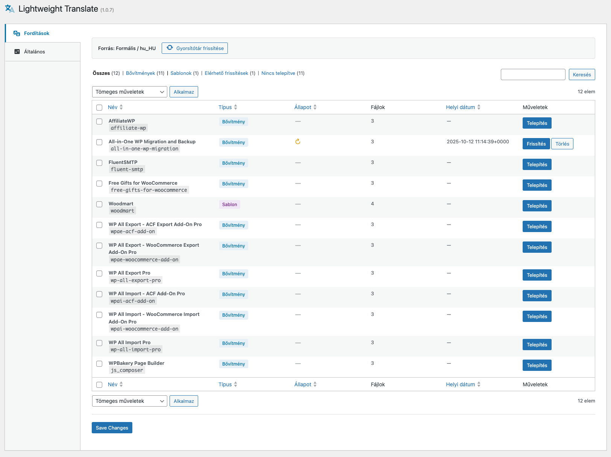

# LW Translate

Manage WordPress translations from community repositories — directly from your admin dashboard.

LW Translate connects to GitHub-hosted translation repositories (like [hellowpio/wordpress-translations](https://github.com/hellowpio/wordpress-translations)) and lets you browse, install, update, and delete translations for your installed plugins and themes with a single click.



## Features

- **Translation browser** — WP_List_Table with search, sort, filter, and pagination
- **One-click install/update** — download translation files directly to `WP_LANG_DIR`
- **SHA-based update detection** — compares git blob hashes, no unnecessary downloads
- **Formal & informal tone** — switch between translation variants (e.g. polite vs. familiar)
- **Multi-locale support** — works with any locale available in the repository
- **Bulk actions** — install, update, or delete multiple translations at once
- **Smart caching** — GitHub API responses cached with configurable TTL
- **Safe file operations** — uses `WP_Filesystem` for all writes

## Requirements

- PHP 8.1+
- WordPress 6.0+

## Installation

### Via Composer

```bash
composer require lwplugins/lw-translate
```

### Manual

1. Download the latest release ZIP from [Releases](https://github.com/lwplugins/lw-translate/releases)
2. Upload to `wp-content/plugins/`
3. Activate in WordPress admin

## Usage

1. Go to **LW Plugins → Translate** to browse available translations
2. Click **Install** or **Update** next to any item
3. Configure tone, locale, and cache TTL in **LW Plugins → Translate Settings**

### Translation Status

| Icon | Meaning |
|------|---------|
| ✔ Green | Up to date — local and remote SHA match |
| ↻ Orange | Update available — remote version differs |
| — Grey | Not installed — no local translation file |

## How It Works

1. Fetches the full repository tree via [GitHub Trees API](https://docs.github.com/en/rest/git/trees)
2. Parses files matching `{tone}/{plugins|themes}/{locale}/{slug}/`
3. Cross-references with installed plugins/themes
4. Compares local `.mo` file SHA with remote SHA to detect updates
5. Downloads files via raw GitHub URL and writes them with `WP_Filesystem`

## Settings

| Option | Default | Description |
|--------|---------|-------------|
| Tone | `formal` | Formal or informal translation variant |
| Locale | `hu_HU` | Target locale code |
| Cache TTL | `43200` | GitHub tree cache duration in seconds (12h) |

## Documentation

See [docs/user-guide.md](docs/user-guide.md) for the full user guide.

## Development

```bash
# Install dependencies
composer install

# Run code standards check
composer phpcs

# Auto-fix fixable issues
composer phpcbf
```

## License

GPL-2.0-or-later — see [LICENSE](https://www.gnu.org/licenses/gpl-2.0.html)


## Sponsor

<a href="https://sinann.io/">
  
</a>

Supported by [Sinann](https://sinann.io/)
